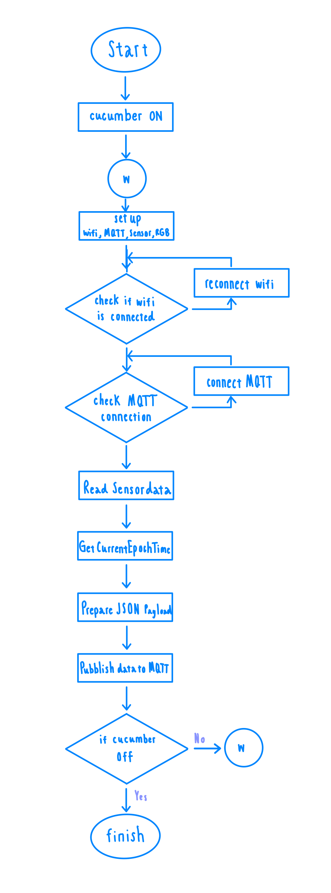

# Ingest and store real-time data from IoT sensors.

## MQTT Topic
ในโปรเจกต์วิชา Iot นี้ใช้ MQTT เป็นโปรโตคอลที่ใช้สำหรับการสื่อสารข้อมูลระหว่าง CUCUMBER RS (ESP32) กับ MQTT Broker โดยมี MQTT Topic ชื่อว่า `iot-frames` สำหรับการส่งข้อมูลจากเซ็นเซอร์ไปยัง Broker ดังนี้

```python
client.publish("iot-frames", jsonBuffer);
```
นี่คือ Topic ที่ใช้เพื่อส่งในช่องเดียวกัน

## MQTT Payload
ข้อมูลที่ส่งไปยัง MQTT Broker จะอยู่ในรูปแบบ JSON Payload ซึ่งประกอบไปด้วยข้อมูลของเซ็นเซอร์ต่าง ๆ และ timestamp 
เช่น กรณีของ Sensor 3 จะต้องส่ง payload ให้อยู่ตามรูปแบบ Pattern ดังนี้  

```json
  doc["id"] = "43245253";
  doc["name"] = "iot_sensor_3";
  doc["place_id"] = "32347983";
  doc["date"] = NTP.getTimeDateString(time(NULL), "%Y-%m-%dT%H:%M:%S");
  doc["timestamp"] = epochTime;
  doc["payload"]["temperature"] = temperature;
  doc["payload"]["humidity"] = humidity;
  doc["payload"]["pressure"] = p;
  doc["payload"]["luminosity"] = ldrValue;
```
- ตัวเวลาจะดึงจาก NTP server และจะได้มาในรูปแบบประมาณนี้ "date": "2024-07-15T10:30:00Z",  
- payload นี้มีความสำคัญเมื่อต้องส่งค่าไปให้ทาง Server  โดย Mosquito จะจัดการทุกอย่างและ นำข้อมูลไปส่งขึ้น Grafrana
## ESP32
- โค้ดสำหรับ CUCUMBER
```cpp

#include <Wire.h>
#include <Adafruit_Sensor.h>
#include <Adafruit_BMP280.h>
#include <SensirionI2CSht4x.h>
#include <Adafruit_HTS221.h>
#include <Adafruit_MPU6050.h>
#include <PubSubClient.h>
#include <WiFi.h>
#include <ArduinoJson.h>
#include <WiFiUdp.h>
#include <ESPNtpClient.h>
#include <Adafruit_NeoPixel.h>

// WiFi credentials

const char* ssid = "TP-Link_CA30";
const char* password = "29451760";


// MQTT Broker settings

const char* mqtt_server = "172.16.46.37";

// 3
const int mqtt_port = 1883;
const char* mqtt_user = "iot-frames-3"; // Replace with your MQTT username if needed
const char* mqtt_password = "piN5S6"; // Replace with your MQTT password if needed

const PROGMEM char* ntpServer = "172.16.46.37";

#define NTP_TIMEOUT 5000

// MQTT Client
WiFiClient espClient;
PubSubClient client(espClient);

// Sensors
Adafruit_BMP280 bmp;
SensirionI2CSht4x sht4x;
Adafruit_HTS221 hts;
Adafruit_MPU6050 mpu;

// LED pin
const int ledPin = 2;

// NeoPixel
#define PIN 18  // กำหนดขาให้เชื่อมต่อกับ NeoPixel
#define NUMPIXELS 1  // จำนวนของ NeoPixel

Adafruit_NeoPixel pixels(NUMPIXELS, PIN, NEO_GRB + NEO_KHZ800);

// ldr GPIO 5
const int ldrPin = 5;  // GPIO5 for LDR

// MQTT callback function only one sensor
void callback(char* topic, byte* payload, unsigned int length) {
  // Serial.print("Message arrived [");
  // Serial.print(topic);
  // Serial.print("] ");
  
  String message;
  for (int i = 0; i < length; i++) {
    message += (char)payload[i];
  }
  // Serial.println(message);

  // Parse JSON
  StaticJsonDocument<200> doc;
  DeserializationError error = deserializeJson(doc, message);
  
  if (error) {
    Serial.print("deserializeJson() failed: ");
    Serial.println(error.f_str());
    return;
  }

  const char* sensor_name = doc["name"];

  // Check if the sensor name is "iot_sensor_3"
  if (strcmp(sensor_name, "iot_sensor_3") == 0) {
    // Serial.print("----------------------------Filtered message: ");
    Serial.println(message);
  }
}

void setup_wifi() {
  delay(10);
  // Define the desired IP address and subnet mask
  IPAddress ip(172, 16, 46, 31);  // Desired IP address
  IPAddress gateway(172, 16, 46, 1);  // Default gateway IP address
  IPAddress subnet(255, 255, 255, 0);  // Subnet mask
  
  // Connect to Wi-Fi network with specified IP configuration
  Serial.println();
  Serial.print("Connecting to ");
  Serial.println(ssid);

  WiFi.config(ip, gateway, subnet);  // Set static IP configuration

  WiFi.begin(ssid, password);

  while (WiFi.status() != WL_CONNECTED) {
    delay(500);
    Serial.print(".");
  }

  Serial.println("");
  Serial.println("WiFi connected");
  Serial.print("IP address: ");
  Serial.println(WiFi.localIP());
}

void reconnect() {
  while (!client.connected()) {
    Serial.print("Attempting MQTT connection...");
    setStatusLED(2);  // กำลังเชื่อมต่อกับ MQTT YELLOW สลับ GREEN 5วิ
    delay(1000);
    setStatusLED(2);  // กำลังเชื่อมต่อกับ MQTT YELLOW สลับ GREEN 5วิ
    delay(1000);
    if (client.connect("iot_sensor_3", mqtt_user, mqtt_password)) {
      Serial.println("connected");
      setStatusLED(5);  // MQTT เชื่อมต่อแล้ว GREEN
      client.subscribe("iot-frames");
      delay(2000); // 5000
    } else {
      Serial.print("failed, rc=");
      Serial.print(client.state());
      Serial.println(" try again in 5 seconds");
      delay(5000); // 5000
    }
  }
}

// RGB 
void setupRGB() {
  pixels.begin(); // Initialize NeoPixel
  pixels.setBrightness(50);  // กำหนดความสว่างของ NeoPixel
}
void setRGBColor(uint8_t red, uint8_t green, uint8_t blue) {
  pixels.clear();  // ล้างสีเก่า
  pixels.setPixelColor(0, pixels.Color(red, green, blue));  // ตั้งค่าสีใหม่
  pixels.show();  // แสดงสีที่เลือก
}
// G R B
void setStatusLED(int status) {
  switch (status) {
    case 0: // ยังไม่ได้เชื่อมต่อ Wi-Fi และ MQTT
      setRGBColor(0, 255, 0); // สีแดง
      break;
    case 1: // เชื่อมต่อ Wi-Fi ได้
      setRGBColor(255, 0, 0); // สีเขียว
      delay(500);
      break;
    case 2: // ระหว่างเชื่อมต่อ MQTT
      setRGBColor(255, 255, 0); // สีเหลือง
      break;
    case 3: // ระหว่างส่งข้อมูล
      setRGBColor(255, 255, 255); // สีขาว
      delay(1000);
      setRGBColor(0, 0, 0); // ปิดไฟกระพริบ
      delay(500);
      break;
    case 4: // ระหว่าง
      setRGBColor(151, 252, 0); // สี
      delay(1000);
      setRGBColor(0, 0, 0); // ปิดไฟกระพริบ
      delay(500);
      break;
    case 5: // ระหว่าง
      setRGBColor(0, 0, 0); // สี
      delay(1000);
      setRGBColor(0, 0, 0); // ปิดไฟกระพริบ
      delay(500);
      break;
  }
}

void setupHardware() {
  Wire.begin(41, 40, 100000);
  if (bmp.begin(0x76)) {
    Serial.println("BMP280 sensor ready");
  }

  sht4x.begin(Wire, 0x44);
  Serial.println("SHT4x sensor initialized");

  // if (hts.begin_I2C(0x5F)) {
  //   Serial.println("HTS221 sensor ready");
  // } else {
  //    Serial.println("HTS221 sensor NOT ready!!!");
  // }

  if (mpu.begin(0x68)) {
    Serial.println("MPU6050 sensor ready");
  } 

  pinMode(ledPin, OUTPUT);
  digitalWrite(ledPin, HIGH); 

  pinMode(ldrPin, INPUT);  // prepare LDR

}

void setup() {
  Serial.begin(115200);
  setupHardware();
  setStatusLED(0); //////////
  setup_wifi();
  setupRGB();
  setStatusLED(1);  // Wi-Fi เชื่อมต่อแล้ว GREEN

  client.setServer(mqtt_server, mqtt_port);
  client.setCallback(callback);

  NTP.setTimeZone(TZ_Asia_Bangkok);
  NTP.setInterval(600);
  NTP.setNTPTimeout(NTP_TIMEOUT);
  NTP.begin(ntpServer);

  Serial.println("Starting!!!");
}

unsigned long Get_Epoch_Time(){
  time_t now;
  struct tm timeinfo;
  if (!getLocalTime(&timeinfo)) {
    return 0;
  }
  time(&now);
  return now;
}

void loop() {
  if (WiFi.status() != WL_CONNECTED) {
    setStatusLED(0);  // แสดงสถานะ Wi-Fi หลุดด้วยสีแดง
    setup_wifi();  // พยายามเชื่อมต่อ Wi-Fi ใหม่
  } else {
    if (!client.connected()) {
      reconnect();
    }
    client.loop();
  
    static uint32_t prev_millis = 0;
    const size_t capacity = JSON_OBJECT_SIZE(6) + 200;
    StaticJsonDocument<capacity> doc;
  
    if (millis() - prev_millis > 5000) {
      prev_millis = millis();
  
      float p = bmp.readPressure();
      int ldrValue = analogRead(ldrPin);
      float temperature, humidity;
      int16_t error = sht4x.measureHighPrecision(temperature, humidity);
  
      if (error) {
        Serial.print("Error trying to execute measureHighPrecision(): ");
        Serial.println(error);
      } else {
        unsigned long epochTime = Get_Epoch_Time();
  
        doc["id"] = "43245253";
        doc["name"] = "iot_sensor_3";
        doc["place_id"] = "32347983";
        doc["date"] = NTP.getTimeDateString(time(NULL), "%Y-%m-%dT%H:%M:%S");
        doc["timestamp"] = epochTime;
        doc["payload"]["temperature"] = temperature;
        doc["payload"]["humidity"] = humidity;
        doc["payload"]["pressure"] = p;
        doc["payload"]["luminosity"] = ldrValue;
  
        char jsonBuffer[capacity];
        serializeJson(doc, jsonBuffer);
  
        setStatusLED(3);  // กำลังส่งข้อมูล
        client.publish("iot-frames", jsonBuffer);
      }
      delay(2000);
    }
  }
}


```
- Flow chart จากโค้ด Cucumber
