# Data Visualization.


การสร้าง Dashboard สำหรับ Visualization โดยใช้ Grafana และ FlowCharting คือการนำข้อมูลจากเซ็นเซอร์มาวิเคราะห์และแสดงผลในรูปแบบแผนผังสถานที่ผ่าน FlowCharting ซึ่งเป็น Plugin ของ Grafana ที่ช่วยให้ผู้ใช้สามารถสร้างและปรับแต่งแผนผัง (Flowchart) เพื่อแสดงสถานะหรือข้อมูลต่างๆ ให้สามารถเข้าใจง่าย สำหรับการสร้างแผนผังสถานที่ที่ต้องการ ผู้ใช้สามารถสร้างแผนผังนั้นใน Draw.io ซึ่งเป็นเครื่องมือสำหรับการออกแบบ Diagram จากนั้นนำแผนผังที่สร้างเสร็จแล้วมาใช้ใน Grafana ผ่าน FlowCharting Plugin เพื่อเชื่อมต่อกับข้อมูลเซ็นเซอร์ แล้วนำมา แสดงผลข้อมูลลงบน Dashboard ซึ่งจะช่วยให้ผู้ใช้สามารถติดตามสถานะและข้อมูลต่างๆของแต่ละ sensor ได้อย่างมีประสิทธิภาพและเข้าใจง่าย


## งานที่ได้ทำ
จากงานได้ใช้เซ็นเซอร์ทั้งหมด 10 ตัว เพื่อมาแสดงข้อมูล อุณหภูมิ (Temperature), ความชื้น (Humidity), ความสว่าง (Luminosity), และ ความดัน (Pressure) โดยมีทั้งรูปแบบ Guage, Stat และ Graph และยังสามารถเก็บข้อมูลเป็น time series data บน Prometeus ได้อีกด้วย 

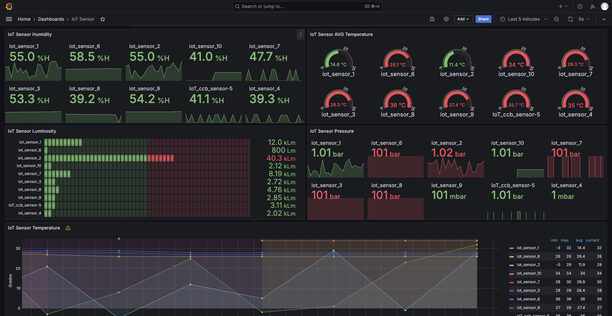

### Humidity

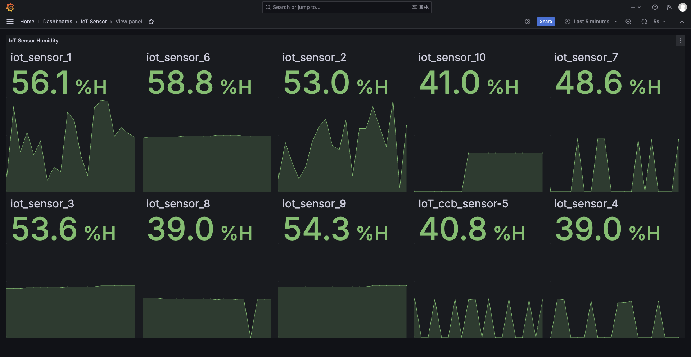
เหตุผลที่ได้เลือกใช้เป็น Stat Chart ในการแสดงค่า Humidity

เนื่องจาก:

1. Stat Chart แสดงข้อมูลที่ชัดเจนและทันที แสดงค่าเดียวที่สำคัญ เช่น ค่าปัจจุบัน ความชื้นสูงสุด หรือต่ำสุด ทำให้สามารถเข้าใจสถานะได้อย่างรวดเร็ว
2. Stat chart เหมาะสำหรับการเน้นข้อมูลที่มีความสำคัญและต้องการการตรวจสอบบ่อยครั้ง เนื่องจากความชื้นมีค่าความเปลี่ยนแปลงอยู่ตลอดเวลา เพราะเมื่อมีความชื้นสูงขึ้น ค่าขอกราฟจะพุ่งขึ้นอย่างเห็นได้ชัด
3. Stat Chart สามารถเห็นได้ชัดมากที่สุดเมื่อข้อมูลมีความเปลี่ยนแปลงไปมากเพื่อสังเกตุความผิดปกติของความชื้น ทำให้สามารถวิเคราะห์แนวโน้มของสภาพอากาศได้ เช่นฝนกำลังจะตก หรือภัยทางธรรมชาติ


### Temperature

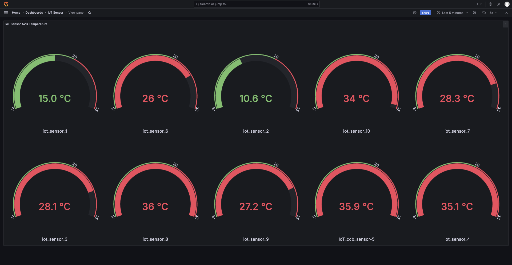

เหตุผลที่ได้เลือกการเลือกใช้ Gauge chart ในการแสดงค่า Temperature

เนื่องจาก:

1. Gauge chart เป็นแผนภูมิที่เหมือนหน้าปัดของเครื่องมือวัด ทำให้ผู้ใช้สามารถเห็นค่าปัจจุบันของอุณหภูมิได้อย่างชัดเจนและเข้าใจได้ง่ายโดยไม่ต้องตีความเยอะ

2. Gauge chart มีลักษณะเหมือนมาตรวัดที่เราคุ้นเคย เช่น มาตรวัดความเร็ว หรือ มาตรวัดอุณหภูมิในรถยนต์ ทำให้ผู้ใช้สามารถตีความสถานะของข้อมูลได้ทันที

3. Gauge chart สามารถตั้งค่าเกณฑ์เพื่อแบ่งช่วงอุณหภูมิเป็นโซนต่างๆ เช่น โซนเย็น โซนปกติ โซนร้อน หรือโซนอันตราย ทำให้ผู้ใช้ทราบสถานะของอุณหภูมิ


### Luminosity

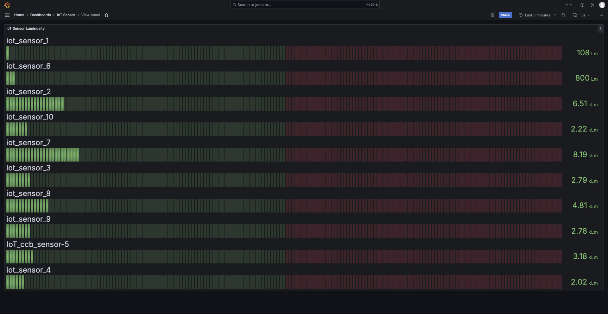
เหตุผลที่ได้เลือกการเลือกใช้ Bar chart ในการแสดงค่า luminosity

เนื่องจาก:

1. Bar chart สามารถเปรียบเทียบค่าได้ชัดเจน เหมาะสำหรับการแสดงค่า luminosity จากหลายแหล่งหรือช่วงเวลา เพราะสามารถเปรียบเทียบค่าความสว่างได้อย่างชัดเจนระหว่าง sensor แต่ละตัว

2. ความยาวของแท่งกราฟใน Bar chart ทำให้สามารถมองเห็นค่าความสว่างได้ง่าย โดยไม่จำเป็นต้องใช้การตีความซับซ้อน ถ้าเยอะแสดงว่าสว่างมาก ถ้าน้อยแสดงว่าสว่างน้อย

3. Bar chart สามารถใช้ในการแสดงการเปลี่ยนแปลงของค่า Luminosity ในระยะยาว ทำให้สามารถวิเคราะห์แนวโน้มได้อย่างชัดเจน 

### Pressure

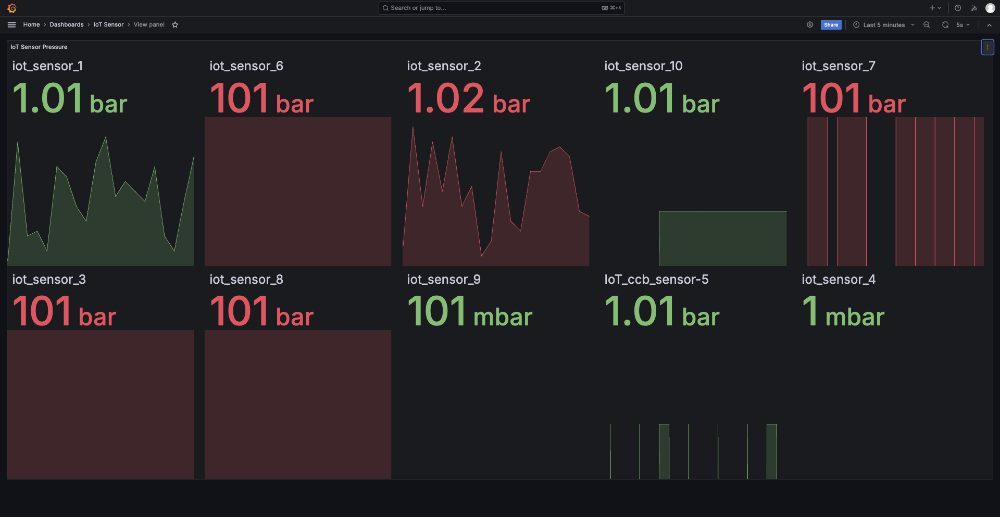

เหตุผลที่ได้เลือกใช้เป็น Stat Chart ในการแสดงค่า Pressure

เนื่องจาก:

1. Stat Chart ช่วยเน้นไปที่ค่าความดันที่สำคัญในขณะนั้น ซึ่งเป็นประโยชน์ในสถานการณ์ที่ต้องการติดตามความผิดปกติหรือความเสี่ยงทันที

2. Stat Chart เน้นการตรวจสอบของการเปลี่ยนแปลงอย่างรวดเร็ว เช่น หากค่าความดันเกินจากช่วงปกติ สามารถสังเกตได้ทันทีผ่าน Stat Chart ที่แสดงค่าเดียวอย่างชัดเจน

3. Stat Chart ไม่มีความซับซ้อนของข้อมูล จึงไม่จำเป็นต้องแสดงการเปลี่ยนแปลงเชิงลึก จึงให้ความกระชับและเข้าใจง่าย

นอกจากนี้ได้แสดงผลอุณหภูมิบนแผนผังบ้านผ่าน FlowCharting (Plugin ของ Grafana) สำหรับการจำลองเป็น smart home ช่วยให้คุณสามารถตรวจสอบและติดตามสภาพแวดล้อมภายในบ้านได้อย่างมีประสิทธิภาพ
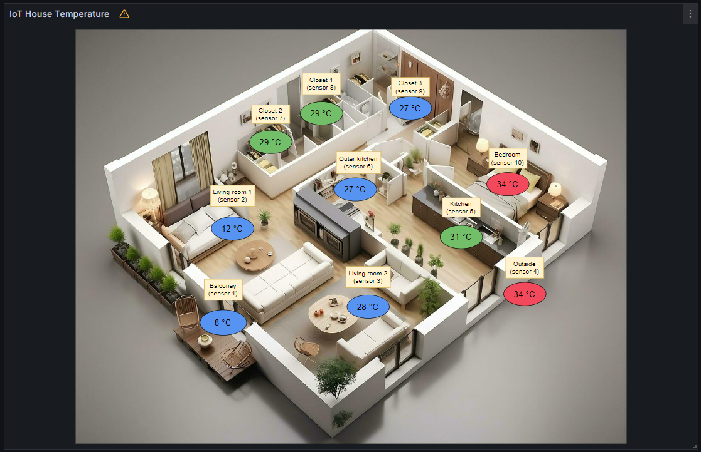

โดยการแสดงผลบนแผนผังบ้าน สามารถใช้การเปลี่ยนสีของเซ็นเซอร์บนแผนผังเพื่อแสดงสถานะต่าง ๆ เช่น หากอุณหภูมิในห้องใดห้องหนึ่งสูงหรือต่ำเกินไป แผนผังจะแสดงสีที่แตกต่างกัน โดยเมื่ออุณหภูมิสูงกว่าที่กำหนด sensor จะเปลี่ยนเป็นสีแดง เพื่อแสดงถึงความร้อน และเมื่ออุณหภูมิต่ำเกินไป sensor จะเปลี่ยนเป็นสี น้ำเงิน เพื่อแสดงถึงความเย็น เป็นการแจ้งเตือนให้ทราบถึงความผิดปกติที่เกิดขึ้นภายในบ้าน วิธีนี้ช่วยให้ผู้ใช้งานสามารถรับรู้และดำเนินการแก้ไขได้ทัน ทำให้ smart home นี้มีความปลอดภัยและประหยัดพลังงานมากขึ้น

และยังได้ทำการตรวจจับ performance ของเครื่อง gateway โดยการ Monitoring Linux host metrics ด้วย node exporter plugin ผ่าน Dashbord ของ Grafana ข้อมูลที่รับมาจะถูกนำไปเก็บ time series เหมือนกันกับค่าที่ได้รับมาจาก sensor และนำมา Visualize บน dashboard โดยจะแสดงข้อมูล CPU, Memory, Storage Disk, Network และ System  ฯลฯ 

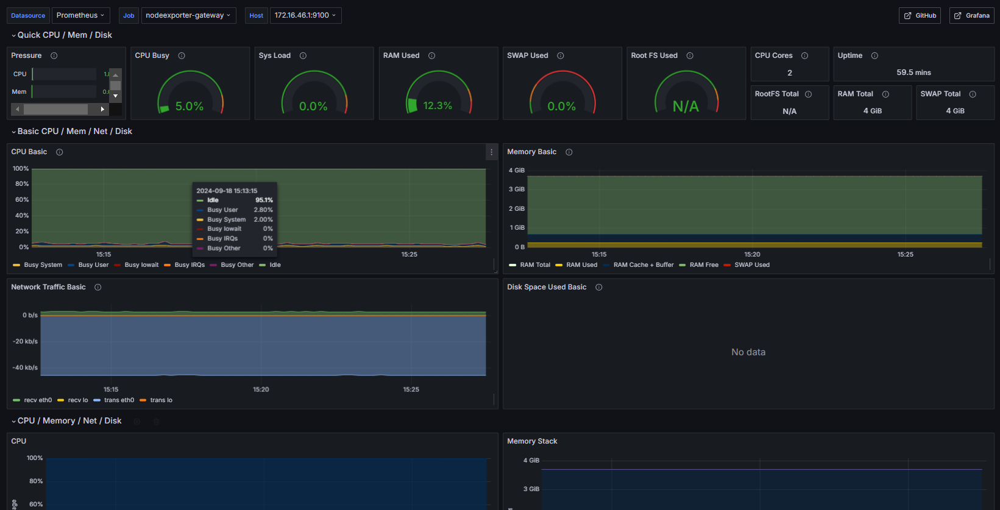


# Start grafana 
## Mount volume for grafana

ในการติดตั้ง FlowCharting plugin สำหรับ Grafana ขั้นตอนแรกที่สำคัญคือการ mount volume เพื่อจัดเก็บ plugin นี้อย่างถาวร การ mount volume จะช่วยให้ข้อมูลและ plugin ที่ติดตั้งอยู่ในพื้นที่เก็บข้อมูลนี้สามารถเข้าถึงได้อย่างต่อเนื่องแม้ในกรณีที่ระบบต้องรีสตาร์ทหรือมีการอัปเดต


ใช้โค้ดด้านล่างนี้ในไฟล์ `docker-compose.yml`

```yaml
grafana:
  image: grafana/grafana:latest-ubuntu
  container_name: grafana
  user: "0"
  volumes:
    - ./grafana/data:/var/lib/grafana 
    - ./grafana/dashboards:/etc/grafana/provisioning/dashboards
    - ./grafana/datasources:/etc/grafana/provisioning/datasources
  environment:
    - GF_SECURITY_ADMIN_USER=${ADMIN_USER:-admin}
    - GF_SECURITY_ADMIN_PASSWORD=${ADMIN_PASSWORD:-admin}
    - GF_INSTALL_PLUGINS=grafana-clock-panel,grafana-worldmap-panel,grafana-piechart-panel
    - GF_USERS_ALLOW_SIGN_UP=false
    - GF_SECURITY_ANGULAR_SUPPORT_ENABLED=True
    - GF_FEATURE_TOGGLES_ANGULARDEPRECATIONUI=FALSE
  restart: unless-stopped
  links:
    - prometheus
  ports:
    - "8085:3000"

```

## Install flowcharting on grafana

### Step 1
เข้าไปที่ https://github.com/skyfrank/grafana-flowcharting/releases/tag/v1.0.0e 

### Step 2
Download Assets:
agenty-flowcharting-panel-1.0.0e.231214594-SNAPSHOT.zip 

### Step 3
เข้า Folder plugins แล้วเก็บไฟล์ zip ไว้ใน Folder 
```yaml
cd iot_event_streaming_architechture/grafana/data/plugins/src
```
### Step 4
extract unzip ไฟล์ zip ที่ได้จากขั้นตอนที่ 2

```yaml
unzip agenty-flowcharting-panel-1.0.0e.231214594-SNAPSHOT.zip -d ../grafana-flowcharting
```
### Step 5
เมื่อ extract ไฟล์เรียบร้อยแล้ว จะต้อง restart grafana ใหม่
```yaml
docker compose restart grafana
```
### Step 6 
เข้าไปที่ grafana เพื่อดูว่ามี plugin ชื่อ FlowCharting ติดตั้งแล้วหรือยังเพื่อตรวจสอบว่าติดตั้งเรียบร้อยแล้ว


<!-- 
docker exec -it grafana /bin/bash
cd /etc/grafana/
apt-get update
apt-get install vim
vim grafana.ini
แก้ไข vim 
cd var/lib/grafana/plugins
grafana-cli plugins install agenty-flowcharting-panel -->


## Using flowcharting on grafana

ในตัวอย่างนี้จะบอกอุณหภูมิที่ sensor ทั้งหมด 10 ตัวตรวจจับได้จากโซนต่างๆของบ้าน 1 ชั้นเพื่อจำลองเป็น smart home

### Step 1
กด Add ในหน้า grafana dashboard โดยเลือกเป็น flowcharting เพื่อสร้าง widget แปลนบ้าน 

### Step 2
กด edit เพื่อเข้าไปแก้ไข draw.io เพื่อเอารูปแปลนบ้าน 1 ชั้นมาใส่ ทำให้อยู่ในรูปแบบนี้

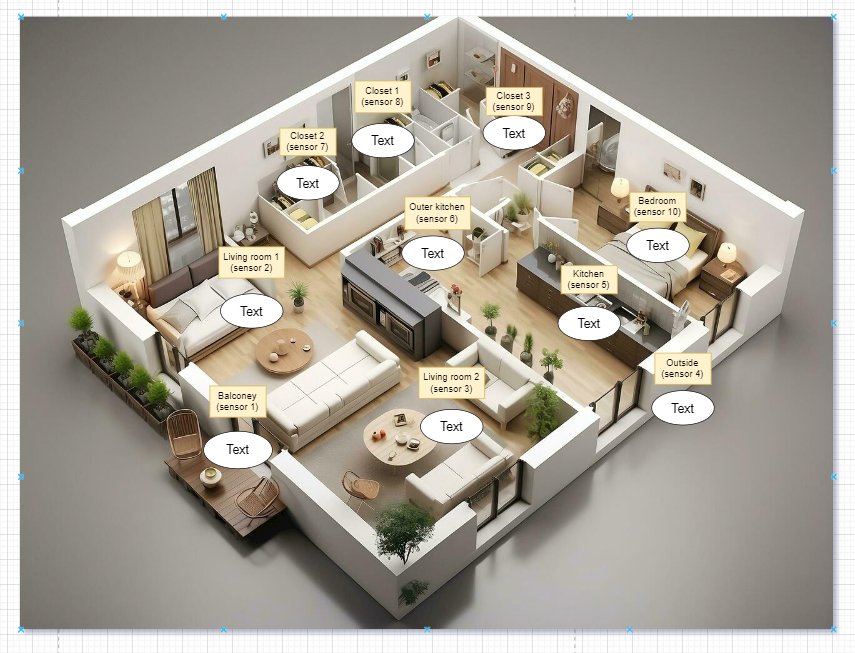

- เพิ่มวงรีที่มี Text ภายในเพื่อเป็นตัวแสดงถึงอุณหภูมิ ณ บริเวณ zone นั้นๆ
- เพิ่ม block รวมถึงตั้งชื่อโซนนั้นๆเพื่อเป็นการบอกว่าเซ็นเซอร์ตัวไหนอยู่โซนไหน


### Step 3
เป็นการ query ข้อมูล Time Series data จาก Prometheus โดยจะเลือกเป็น sensor อุณหภูมิ โดยตั้งlabel เป็น sensor_name แล้วเลือก sensor ตัวที่ต้องการ แล้วกด run queries

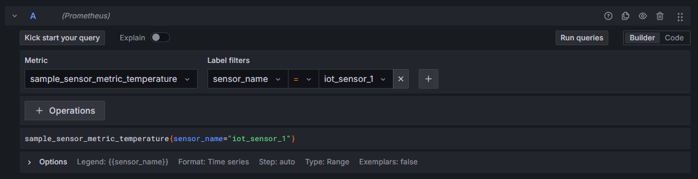

### Step 4
เป็นการ set up rule เพื่อเป็นตัวแจ้งเตือนว่าอุณหภูมิอยู่ในช่วงไหน

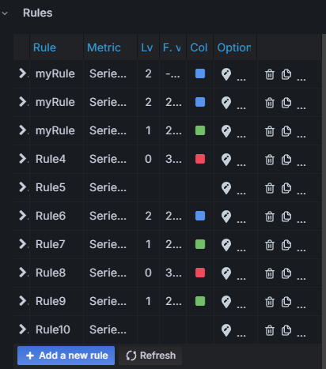

### Step 5
เมื่อทำเสร็จครบแล้วจะสามารถ save และ apply ได้ภาพตามนี้


## Node exporter 
### Step 1
เปิดการใช้งาน port nodeexporter-gateway ในไฟล์ prometheus.yaml ใน folder prometheus
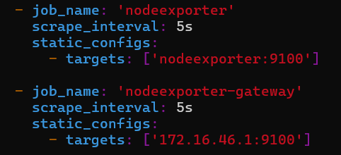

### Step 2
Import file Node Exporter Full rev37.json บน Grafana

### Step 3
เลือกใช้ข้อมูล nodeexporter-gateway 
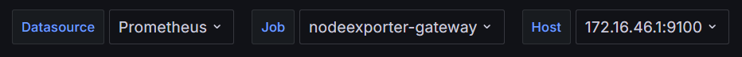